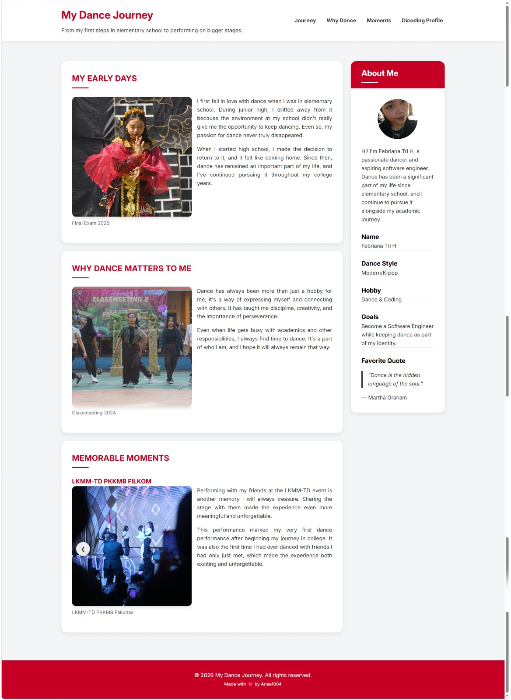

# 💃 My Dance Journey

My First personal website built with HTML, CSS, and JavaScript as part of the Dicoding **Belajar Dasar Pemrograman Web** submission.

## 📖 About the Project

My Dance Journey was originally created as a submission project for Dicoding's **Belajar Dasar Pemrograman Web** course. However, since I also wanted it to become part of my portfolio, I decided to build something more meaningful than a generic website.

Instead of choosing a random topic, I chose to share one of my biggest passions—dance. This website tells the story of my journey, from my first dance experiences in elementary school to some of my most memorable performances in high school and college.

Building this project has been an incredible learning experience. I started with the basics of HTML and CSS, gradually explored more advanced styling techniques, and even got my first hands-on experience with JavaScript by creating simple interactive features like an image slider and active navigation.

## ✨ Features

- Responsive layout for desktop, tablet, and mobile
- Sticky navigation bar
- Smooth scrolling navigation
- Active navigation highlight while scrolling
- Interactive image slider
- Personal profile sidebar
- Clean card-based UI design

## 🛠️ Built With

- HTML5
- CSS3
- JavaScript (Vanilla)

## 📁 Project Structure

```
my-dance-journey/
│
├── index.html
│
├── assets/
│   ├── images/
│   ├── scripts/
│   │   └── script.js
│   └── styles/
│       └── style.css
│
└── README.md
```

## 📸 Preview



## 🎯 What I Learned

Through this project, I learned how to:

- Build semantic HTML structures
- Create responsive layouts using Flexbox
- Implement sticky navigation
- Use CSS pseudo-elements for styling
- Build a simple image slider using JavaScript
- Highlight active navigation links while scrolling
- Organize project files for better maintainability

## 👩‍💻 Author

**Febriana Tri H**

- Dicoding: https://www.dicoding.com/users/anaa1004

---
